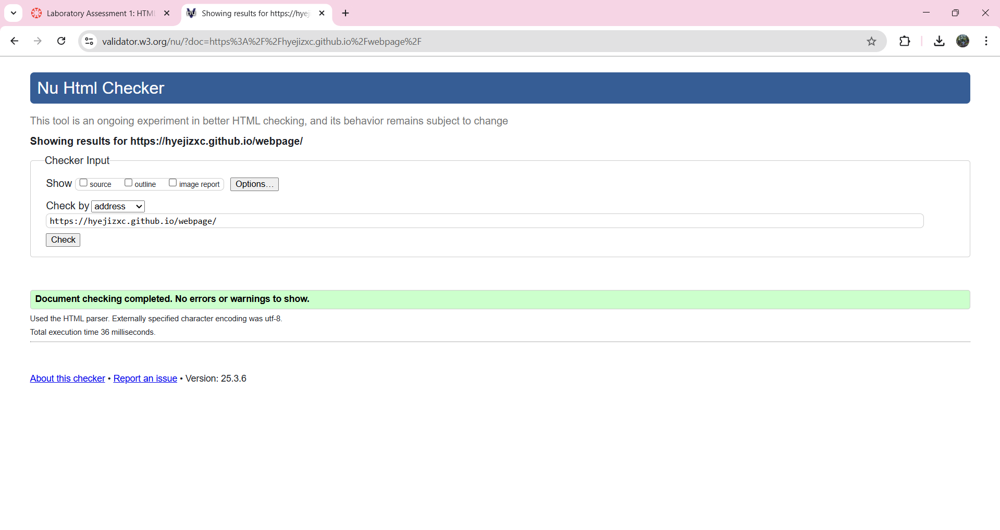

# Semantic Webpage

## Purpose
This webpage demonstrates the use of semantic HTML elements for better accessibility, SEO, and code readability.

## Semantic Elements Used
- `<header>`: Defines the webpage's header.
- `<nav>`: Contains navigation links.
- `<article>`: Represents an independent piece of content.
- `<section>`: Groups related content.
- `<aside>`: Provides additional information.
- `<footer>`: Defines the page footer.

## Accessibility Considerations
- Proper use of semantic elements for screen readers.
- Alt attributes for images (if added ).
- Clear and descriptive links.

## Deployment
This page is hosted on GitHub Pages: https://hyejizxc.github.io/webpage/

## Validation
The HTML file has been validated using the W3C Validator. Below is the validation screenshot:

